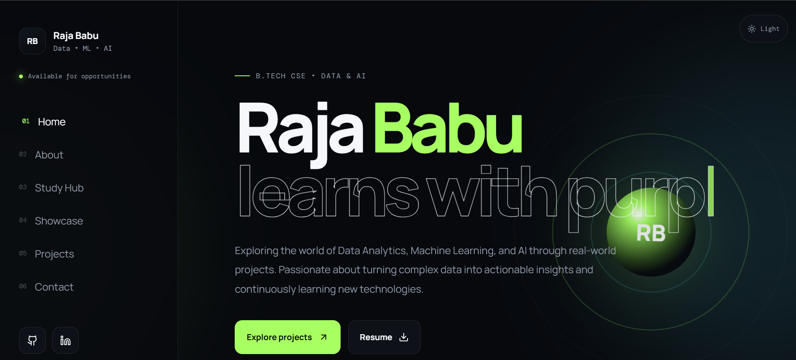

# Raja Babu | Data, Machine Learning & AI

Personal portfolio of **Raja Babu**, a Computer Science and Engineering student interested in data analytics, data science, and artificial intelligence. The site brings together selected projects, a study hub, and ways to connect.



## Portfolio

The portfolio is built with Next.js and includes:

- Responsive layouts with light and dark themes
- Selected project highlights and detailed project views
- A study hub covering Python, machine learning, Power BI, SQL, Excel, and statistics
- Resume access and links to GitHub and LinkedIn

## Featured Projects

| Project | Overview | Links |
| --- | --- | --- |
| Movie Recommender System | Content-based movie recommendations built with Python and Streamlit, with poster information from TMDB. | [Live demo](https://movierecommendation-dya5muadz9ne9yjcymj5rr.streamlit.app/) · [Source](https://github.com/Raja786000/movie_recommendation) |
| Fake News Detector | Classifies news text using TF-IDF and Logistic Regression. | [Source](https://github.com/Raja786000/Fake-News-Detector) |
| Construction Intelligence Hub | Prototype construction-photo inspection app using computer-vision checks for common defects. | [Source](https://github.com/Raja786000/Ai-agent-quality-inspection) |

## Tech Stack

- **Framework:** Next.js 15, React 18
- **Language:** JavaScript
- **Animation:** Framer Motion
- **Icons:** Lucide
- **Areas of interest:** Python, SQL, Power BI, Excel, data analytics, machine learning, and AI

## Run Locally

### Requirements

- Node.js 20 or later
- npm

### Setup

```bash
git clone https://github.com/Raja786000/Portfolio-is-mine.git
cd Portfolio-is-mine
npm install
npm run dev
```

Open [http://localhost:3000](http://localhost:3000) in your browser.

## Available Scripts

| Command | Description |
| --- | --- |
| `npm run dev` | Start the development server. |
| `npm run build` | Create a production build. |
| `npm start` | Serve the production build locally. |
| `npm run lint` | Run the configured Next.js lint command. |

## Project Structure

```text
app/
	page.js                 Main portfolio page and project content
	globals.css             Site styles and responsive visual system
	layout.js               Root layout and page metadata
	study/[topic]/page.js   Study topic pages
public/
	assets/
		RajaResumeDS.pdf      Resume
```

## Connect

- [GitHub](https://github.com/Raja786000)
- [LinkedIn](https://www.linkedin.com/in/raja-babu-34a871222/)
